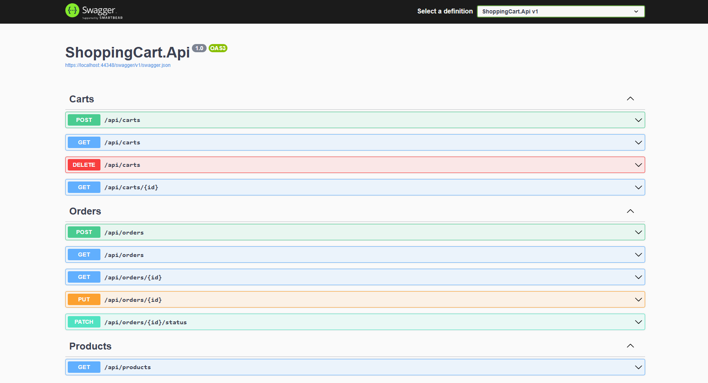
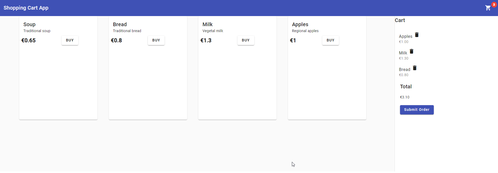

# Shopping Cart

[WIP - Work in Progress] ???

Full-stack application to manage a shopping basket, calculate the total price of grocery
items, apply discounts, and display a detailed receipt.

## Tech stack

- Backend: .NET6, C#, OpenAPI/Swagger ? 
- Frontend: Angular 16 ?
- Database: PostgreSQL ?
- ORM: Entity Framework + Migrations ?
- UnitTests: xUnit ? 
- Integrations Tests: ?? [WIP]
- Logging: Serilog ?? [WIP]
- Monitoring: Grafana + Prometheus ?? [WIP]
- CI: GitHub Actions ?
- Containerization: Docker ?? [WIP]

## How to Run

- Make sure you have PostgreSQL installed.
- Run the following script:

```bash
CREATE USER userdb WITH ENCRYPTED PASSWORD 'userdb1';
GRANT ALL PRIVILEGES ON DATABASE "ShoppingCart" TO userdb;

GRANT USAGE ON SCHEMA public TO userdb;
GRANT CREATE ON SCHEMA public TO userdb;

GRANT ALL PRIVILEGES ON ALL TABLES IN SCHEMA public TO userdb;
```

- Navigate to `src/ShoppingCart.Api` directory and run:
```bash
dotnet run
```

- API will run at: https://localhost:7070/
- API description can be found at: https://localhost:7070/swagger/index.html


- Go to `ui/ShoppingCart` directory and run:
```bash
ng serve
```

- You can access UI app on: http://localhost:4200/


## Screenshots




